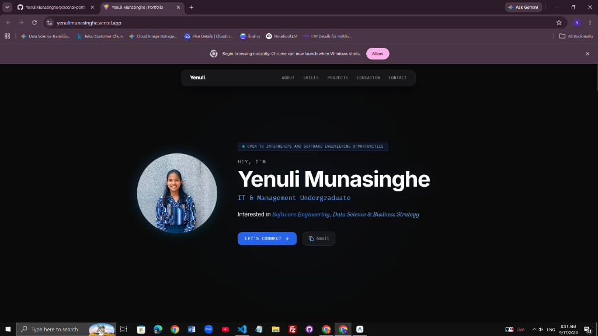
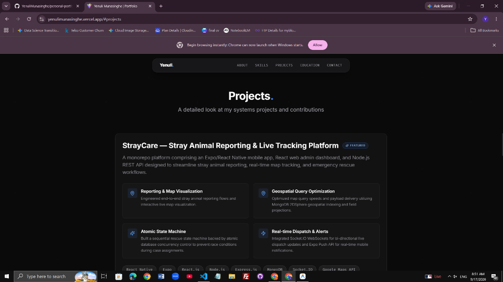
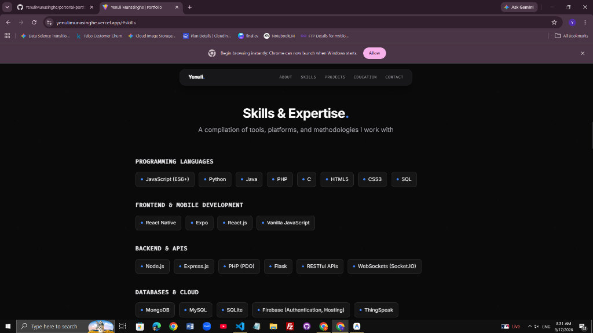
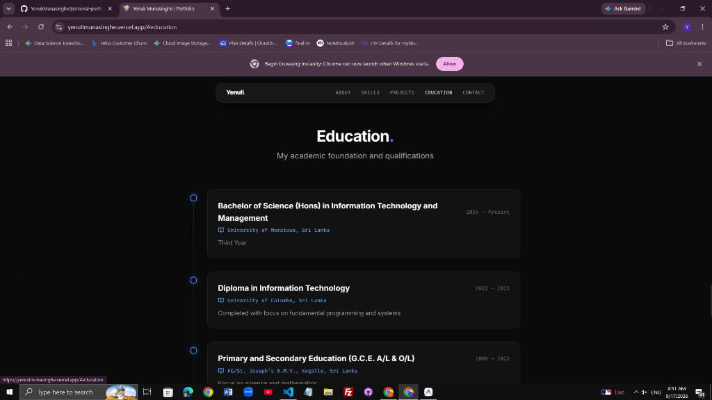
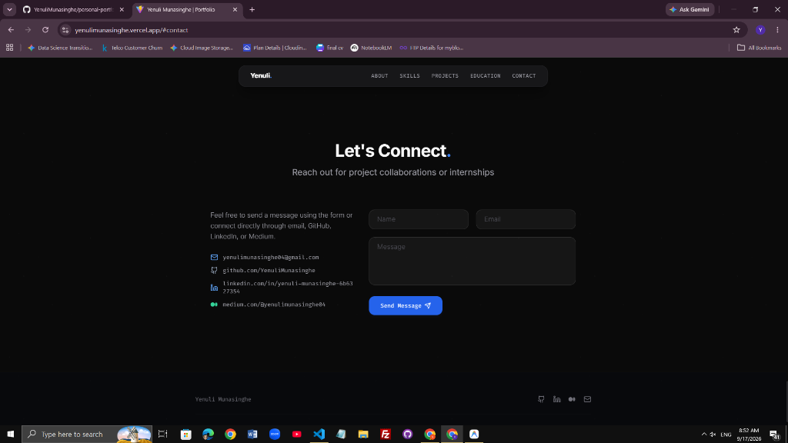

# 🚀 Yenuli Munasinghe — Personal Web Portfolio

[](https://react.dev/)
[](https://vitejs.dev/)
[](https://tailwindcss.com/)
[](LICENSE)
[](package.json)

> **Personal Web Portfolio of Yenuli Munasinghe** — Information Technology & Management Undergraduate at the **University of Moratuwa, Sri Lanka**.

An interactive, high-performance web portfolio built with **React 19**, **Vite 7**, and **Tailwind CSS v3**. Designed with a modern dark-mode aesthetic, sleek glassmorphism panels, ambient background gradients, responsive layouts, interactive project filter/modal components, and data-driven section rendering.

---

## 📸 Screenshots & Preview

| Hero & Intro | Featured Engineering Projects |
| :---: | :---: |
|  |  |

| Skills & Expertise | Academic Education |
| :---: | :---: |
|  |  |

| Let's Connect (Contact) |
| :---: |
|  |

---

## ✨ Key Features

- **⚡ Lightning-Fast Performance**: Powered by Vite 7 for instantaneous HMR and optimized production bundles.
- **🎨 Glassmorphic UI**: High-aesthetic dark design with glowing neon accents, backdrop blurs, and crisp micro-interactions.
- **📱 Fully Responsive**: Seamless layout adaptation for desktop, tablet, and mobile displays using Tailwind CSS grid/flex systems.
- **🔍 Dynamic Project Showcase**: Category filtering (Full Stack, Mobile, IoT, Security) with rich detail modals featuring technical contributions, tech tags, and repository links.
- **📊 Modular Architecture**: Content driven cleanly via a single-source-of-truth configuration file (`src/data/portfolioData.js`).
- **🛠️ Automated CI & Testing**: Built-in unit and component testing powered by Vitest & React Testing Library, paired with GitHub Actions CI workflows.

---

## 🛠️ Tech Stack Matrix

| Layer | Technologies & Tools |
| :--- | :--- |
| **Frontend Framework** | [React 19](https://react.dev/) (ES6+ JSX) |
| **Build Tooling** | [Vite 7](https://vitejs.dev/) with `@vitejs/plugin-react` |
| **Styling & UI** | [Tailwind CSS v3](https://tailwindcss.com/), PostCSS, Autoprefixer, Glassmorphism CSS |
| **Iconography** | [Lucide React](https://lucide.dev/) |
| **Testing** | [Vitest](https://vitest.dev/), `@testing-library/react`, `jsdom` |
| **Linting & Quality** | [ESLint 9](https://eslint.org/) (Flat Config) |
| **Deployment** | [GitHub Pages](https://pages.github.com/) via `gh-pages` CLI |

---

## 📁 Project Architecture

```text
personal-portfolio/
├── .github/
│   └── workflows/
│       └── ci.yml                 # Automated CI Workflow (Lint, Test, Build)
├── public/
│   ├── screenshots/               # Preview images & mockups for README
│   ├── profile.jpg                # Profile photo asset
│   └── vite.svg                   # Favicon
├── src/
│   ├── __tests__/                 # Vitest unit & component test suite
│   │   ├── App.test.jsx
│   │   └── portfolioData.test.js
│   ├── assets/                    # Static assets & images
│   ├── components/                # Modular React UI components
│   │   ├── icons/
│   │   │   └── MediumIcon.jsx     # Custom Medium SVG icon component
│   │   ├── About.jsx              # About me & background section
│   │   ├── Certifications.jsx     # Education & certifications timeline
│   │   ├── Contact.jsx            # Get in touch form & quick links
│   │   ├── Experience.jsx         # Professional & academic timeline
│   │   ├── Footer.jsx             # Site footer & copyright
│   │   ├── Hero.jsx               # Main banner & call-to-actions
│   │   ├── Navbar.jsx             # Sticky navigation header
│   │   ├── ProjectModal.jsx       # Deep-dive detail modal for projects
│   │   ├── Projects.jsx           # Portfolio project gallery & filters
│   │   └── Skills.jsx             # Technical competencies grid
│   ├── data/
│   │   └── portfolioData.js       # Central data model (Bio, Skills, Projects, Education)
│   ├── App.jsx                    # Root application component
│   ├── index.css                  # Global styles & Tailwind directives
│   └── main.jsx                   # React DOM entry point
├── ARCHITECTURE.md                # Detailed technical architecture guide
├── CONTRIBUTING.md                # Open-source contribution guidelines
├── DEPLOYMENT.md                  # Deployment & hosting documentation
├── LICENSE                        # MIT License
├── eslint.config.js               # ESLint configuration
├── index.html                     # HTML template
├── package.json                   # Project dependencies & scripts
├── postcss.config.js              # PostCSS configuration
├── tailwind.config.js             # Tailwind CSS theme customization
└── vite.config.js                 # Vite & Vitest configuration
```

---

## 🚀 Quickstart & Local Setup

### Prerequisites

Ensure you have Node.js (v18.0 or higher) and npm installed:
- [Node.js Download](https://nodejs.org/)

### 1. Clone the Repository

```bash
git clone https://github.com/YenuliMunasinghe/personal-portfolio.git
cd personal-portfolio
```

### 2. Install Dependencies

```bash
npm install
```

### 3. Launch Development Server

```bash
npm run dev
```
Open your browser and navigate to `http://localhost:5173`.

### 4. Run Linter & Tests

```bash
# Run ESLint check
npm run lint

# Execute Vitest test suite
npm test
```

### 5. Build for Production

```bash
npm run build
```
The compiled assets will be output to the `dist/` directory. You can preview the production build locally with:
```bash
npm run preview
```

---

## ⚙️ Customization & Configuration

All portfolio content is driven dynamically from a single file: `src/data/portfolioData.js`. 

To update your profile information:
1. Open `file:///src/data/portfolioData.js`.
2. Edit `personalInfo` (name, tagline, bio, contact links, resume URL).
3. Update `skillsData` categories and skills array.
4. Modify or add projects under `projectsData` (title, shortDescription, contributions, tags, repo links).
5. Update `educationData` and `certificationsData`.

The UI will automatically reflect changes upon hot-reloading or rebuilding.

---

## 🧪 Testing Strategy

The repository uses **Vitest** for fast unit testing and component validation:

```bash
# Run tests once
npm test

# Run tests in watch mode during development
npx vitest
```

---

## 🌐 Deployment

The application is configured for seamless deployment to **GitHub Pages**:

```bash
npm run deploy
```

For custom domain configuration or automated GitHub Actions deployment, consult [`DEPLOYMENT.md`](DEPLOYMENT.md).

---

## 📜 License

This project is open source and available under the [MIT License](LICENSE).

---

## 👩‍💻 Author

**Yenuli Munasinghe**
- **Location**: Kegalle, Sri Lanka
- **Degree**: B.Sc. (Hons) in IT & Management, University of Moratuwa
- **Email**: [yenulimunasinghe04@gmail.com](mailto:yenulimunasinghe04@gmail.com)
- **GitHub**: [@YenuliMunasinghe](https://github.com/YenuliMunasinghe)
- **LinkedIn**: [Yenuli Munasinghe](https://www.linkedin.com/in/yenuli-munasinghe-6b6327354/)
- **Medium**: [@yenulimunasinghe04](https://medium.com/@yenulimunasinghe04)
