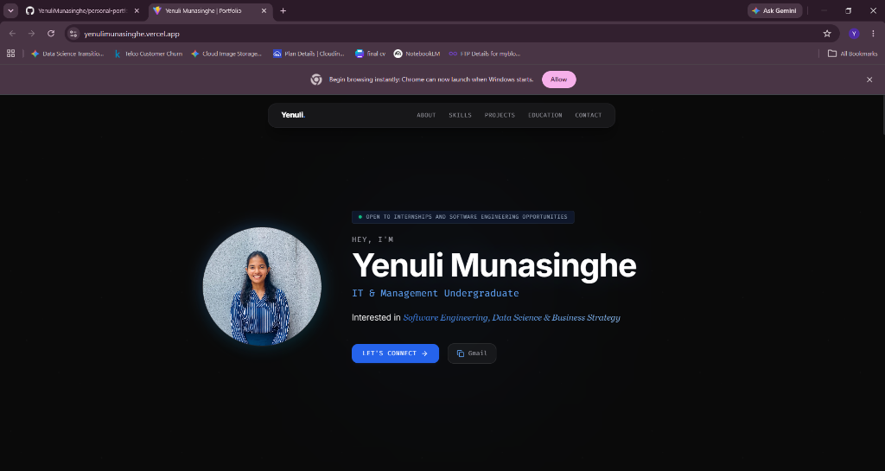
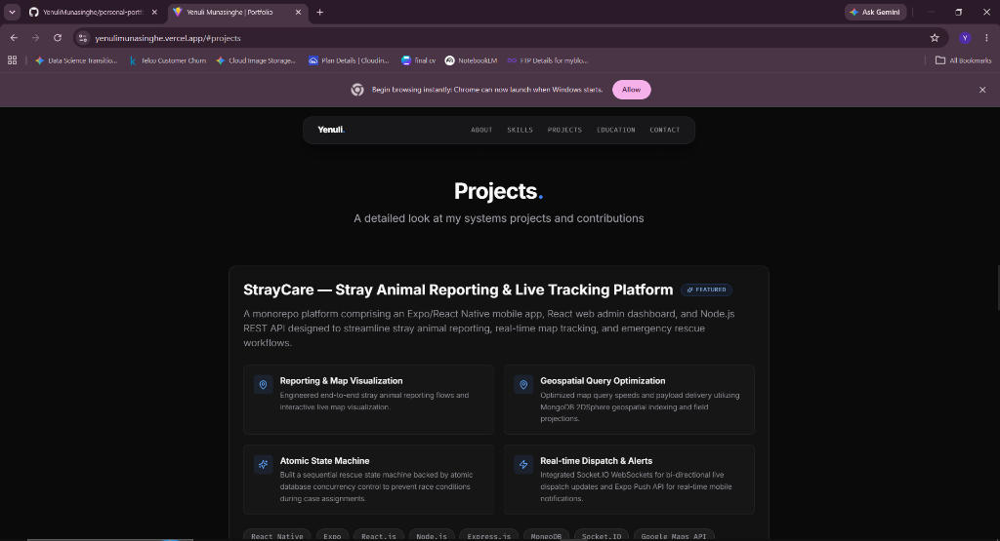
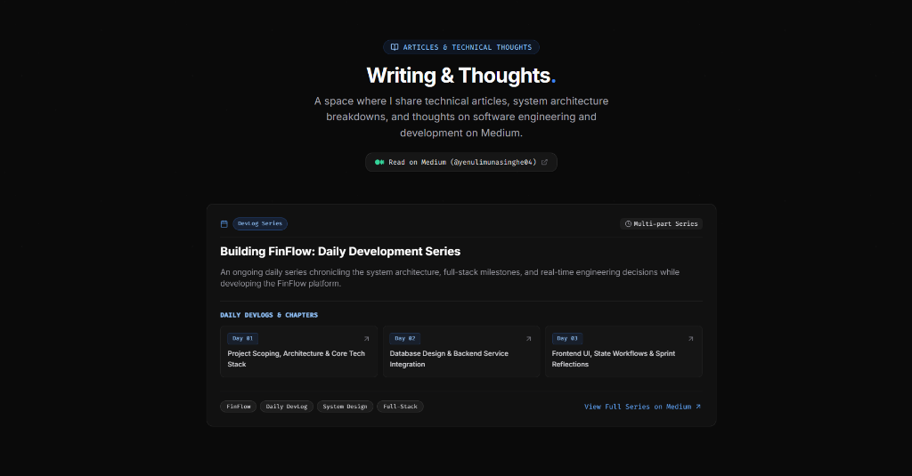
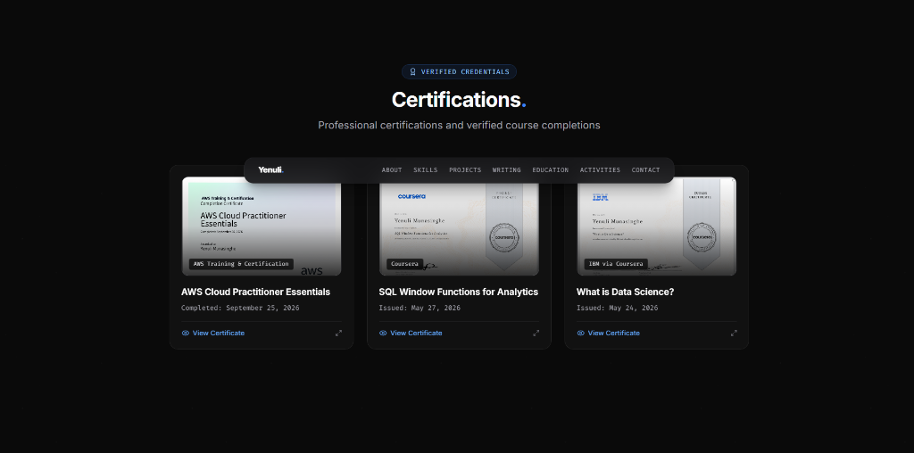
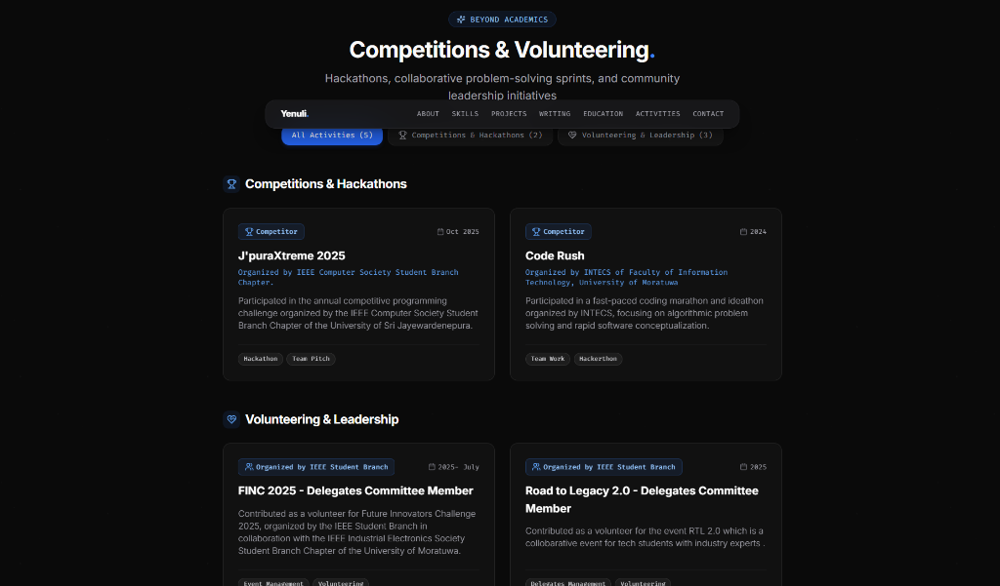
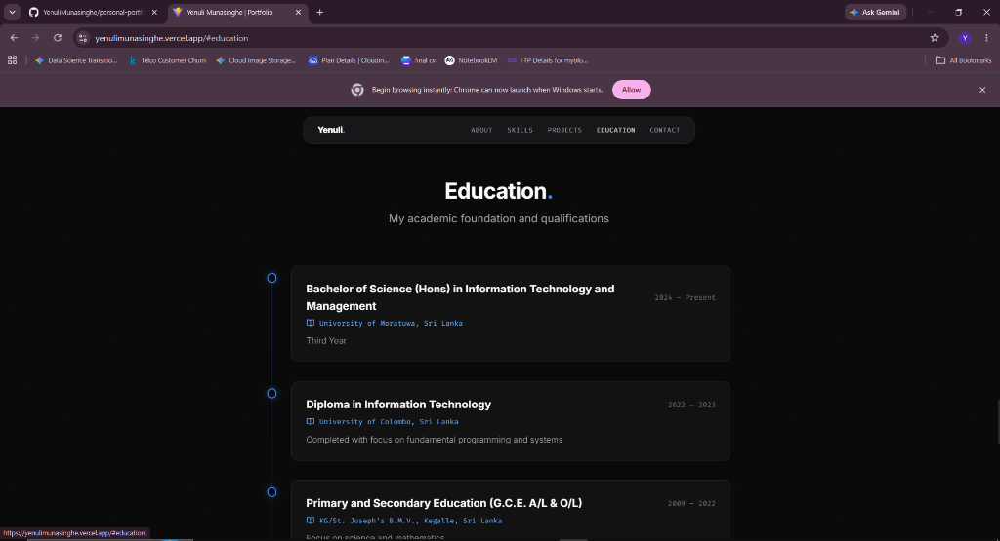
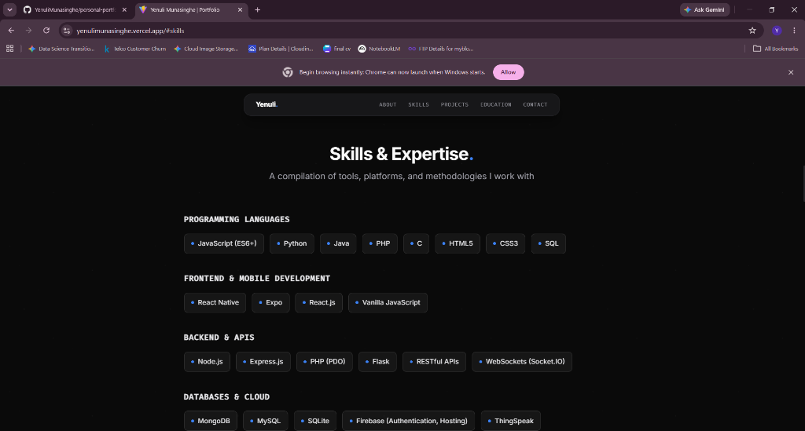
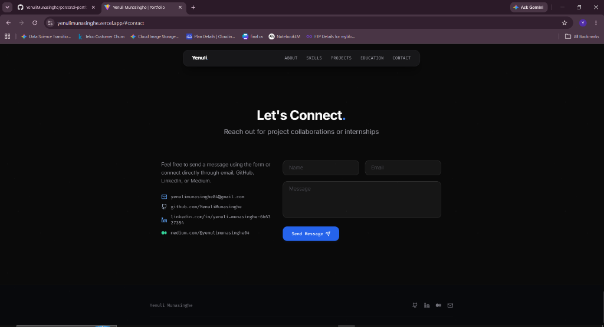

# 🚀 Yenuli Munasinghe — Personal Web Portfolio

[](https://react.dev/)
[](https://vitejs.dev/)
[](https://tailwindcss.com/)
[](https://vitest.dev/)
[](LICENSE)
[](package.json)

> **Personal Web Portfolio of Yenuli Munasinghe** — Information Technology & Management Undergraduate at the **University of Moratuwa, Sri Lanka**.

An interactive, high-performance web portfolio engineered with **React 19**, **Vite 7**, and **Tailwind CSS v3**. Designed with a modern dark-mode aesthetic, sleek glassmorphic surfaces, dynamic ambient gradients, responsive multi-column layouts, deep-dive project detail modals, technical writing showcases, and live contact messaging.

---

## 📸 Screenshots & Preview

| Hero & Intro | Featured Engineering Projects |
| :---: | :---: |
|  |  |

| Technical Writing & Thoughts | Verified Certifications |
| :---: | :---: |
|  |  |

| Competitions & Volunteering | Academic Education |
| :---: | :---: |
|  |  |

| Skills & Expertise | Contact & Messaging |
| :---: | :---: |
|  |  |

---

## ✨ Key Features

- **⚡ Blazing Fast Performance**: Built on Vite 7 with instantaneous Hot Module Replacement (HMR) and optimized tree-shaken production bundles.
- **🎨 Glassmorphic Dark UI**: High-end dark theme featuring subtle starfield background effects, glowing neon accents, backdrop blur filters, and fluid CSS micro-animations.
- **🃏 Project Cards & Deep-Dive Modals**: Responsive 3-column card grid with visual banners, category badges, project types, and a **"View more →"** action opening a comprehensive modal view with architectural breakdowns and authentic hardware/UI imagery.
- **✍️ Technical Writing & Series**: Dedicated section showcasing published Medium articles, daily devlogs, and system architecture breakdowns.
- **🏆 Competitions & Volunteering Hub**: Filterable showcase tracking competitive hackathons, problem-solving sprints, and community leadership initiatives.
- **📬 Working Contact Form**: Integrated with **Formspree** for direct-to-inbox message delivery, backed by a fail-safe `mailto:` client fallback.
- **📱 100% Responsive Design**: Fluid grid and flexbox layouts crafted for mobile, tablet, laptop, and ultra-wide screens.
- **🧪 Comprehensive Testing**: Robust unit and integration test suite using **Vitest** and **React Testing Library** with automated CI validation.

---

## 💻 Featured Engineering Projects

| Project | Type | Description | Key Tech Stack |
| :--- | :--- | :--- | :--- |
| **[StrayCare](https://github.com/TeamTechForge)** | Team Project | Monorepo animal rescue ecosystem featuring multi-step reporting, React Native Maps live tracking, rescuer case lifecycle management, adoption handoff prefilling, and Expo push alerts. | React Native, Expo, Node.js, Express, MongoDB, Socket.IO, Google Maps API |
| **[MyBlog](https://github.com/YenuliMunasinghe/myblog)** | Individual Project | Security-hardened publishing platform engineered with CSRF token defense, HMAC SHA-256 Remember-Me signatures, non-blocking AJAX liking, and glassmorphic UI. | PHP (PDO), MySQL, JavaScript, AJAX, CSS Glassmorphism, Markdown |
| **[FinFlow](https://github.com/YenuliMunasinghe/FinFlow)** | Individual Project | Full-stack financial management prototype for university societies and clubs with event budgeting, income and expense tracking, role-based transaction approval, audit-log foundations, and financial dashboard visualizations. | Next.js 16, React 19, TypeScript, NestJS, Node.js, Prisma ORM, PostgreSQL, Supabase, Tailwind CSS 4, Recharts, JWT, Bcrypt |
| **Smart Server Room Monitor** | Team Project | Industrial IoT environmental automation tracking temperature, humidity, and AC status via ESP32 dual LDR ADC and SGP30 I²C sensors with ThingSpeak telemetry and Firebase-hosted dashboard. | ESP32, C++, SGP30 (I²C), LDR (ADC), ThingSpeak, Firebase Hosting & Auth |

---

## 🛠️ Tech Stack Matrix

| Layer | Technologies & Tools |
| :--- | :--- |
| **Frontend Framework** | [React 19](https://react.dev/) (ES6+ Functional Components & Hooks) |
| **Build & Dev Tooling** | [Vite 7](https://vitejs.dev/) with `@vitejs/plugin-react` |
| **Styling & Design** | [Tailwind CSS v3](https://tailwindcss.com/), PostCSS, Autoprefixer, Glassmorphism CSS |
| **Icons & Visuals** | [Lucide React](https://lucide.dev/) |
| **Form Delivery** | [Formspree API](https://formspree.io/) with `mailto:` fallback |
| **Testing Framework** | [Vitest](https://vitest.dev/), `@testing-library/react`, `@testing-library/jest-dom`, `jsdom` |
| **Code Quality** | [ESLint 9](https://eslint.org/) (Flat Config) |
| **Deployment** | [GitHub Pages](https://pages.github.com/) via `gh-pages` |

---

## 📁 Project Architecture

```text
personal-portfolio/
├── .github/
│   └── workflows/
│       └── ci.yml                 # Automated CI Workflow (Lint, Test, Build)
├── public/
│   ├── screenshots/               # Preview screenshots for documentation
│   ├── myblog.png                 # MyBlog landing page preview
│   ├── server-room-monitor.jpg    # Server room IoT enclosure photo
│   ├── profile.jpg                # Profile photo asset
│   ├── Yenuli_Munasinghe_CV.pdf   # Downloadable curriculum vitae
│   └── vite.svg                   # Favicon
├── src/
│   ├── __tests__/                 # Automated test suite
│   │   ├── App.test.jsx           # App integration & interactive modal tests
│   │   └── portfolioData.test.js  # Data schema integrity tests
│   ├── assets/                    # Static image & vector assets
│   ├── components/                # Modular React UI components
│   │   ├── icons/
│   │   │   └── MediumIcon.jsx     # Custom Medium SVG icon
│   │   ├── About.jsx              # Biography & core focus areas
│   │   ├── Certifications.jsx     # Industry credentials & certificates
│   │   ├── Contact.jsx            # Formspree-powered contact form & social handles
│   │   ├── Experience.jsx         # Academic & professional milestones timeline
│   │   ├── Footer.jsx             # Site footer & copyright
│   │   ├── Hero.jsx               # Hero banner, terminal badge, and CTAs
│   │   ├── Involvement.jsx        # Competitions, hackathons, and volunteering
│   │   ├── Navbar.jsx             # Sticky glassmorphic navbar with mobile menu
│   │   ├── ProjectModal.jsx       # Deep-dive detail modal for projects
│   │   ├── Projects.jsx           # 3-column project cards with "View more →"
│   │   ├── Skills.jsx             # Technical competencies grid
│   │   └── Writing.jsx            # Published technical articles & DevLogs
│   ├── data/
│   │   └── portfolioData.js       # Central data model (Single Source of Truth)
│   ├── App.jsx                    # Root application component
│   ├── index.css                  # Global styles, animations & Tailwind directives
│   ├── main.jsx                   # React DOM entry point
│   └── setupTests.js              # Vitest setup & testing-library matchers
├── .env.example                   # Environment variables template
├── ARCHITECTURE.md                # Technical architecture & design documentation
├── CONTRIBUTING.md                # Contribution guidelines
├── DEPLOYMENT.md                  # Deployment guide (GitHub Pages)
├── LICENSE                        # MIT License
├── package.json                   # Dependencies & npm scripts
├── tailwind.config.js             # Tailwind CSS design system config
└── vite.config.js                 # Vite & Vitest configuration
```

---

## 🚀 Quickstart & Local Setup

### Prerequisites

Ensure you have **Node.js (v18.0 or higher)** and **npm** installed:
- [Node.js Download](https://nodejs.org/)

### 1. Clone the Repository

```bash
git clone https://github.com/YenuliMunasinghe/personal-portfolio.git
cd personal-portfolio
```

### 2. Install Dependencies

```bash
npm install
```

### 3. Configure Environment Variables

Copy the example environment file and add your Formspree Form ID:

```bash
cp .env.example .env
```

Edit `.env`:
```env
VITE_FORMSPREE_FORM_ID=your_form_id_here
```
*(Get a free Form ID in seconds at [formspree.io](https://formspree.io/)).*

### 4. Launch Development Server

```bash
npm run dev
```

Open your browser at **`http://localhost:5173`**.

---

## 🧪 Testing & Quality Assurance

Run the test suite to verify component rendering and interactions:

```bash
# Execute Vitest test suite once
npm test

# Run tests in interactive watch mode
npx vitest

# Run ESLint code inspection
npm run lint
```

---

## 📦 Building for Production

Compile the production bundle with tree-shaking and minification:

```bash
npm run build
```

Preview the production build locally:

```bash
npm run preview
```

---

## 🌐 Deployment to GitHub Pages

Deploy the compiled distribution directly to GitHub Pages:

```bash
npm run deploy
```

For custom domain configuration or automated GitHub Actions deployment, consult [`DEPLOYMENT.md`](DEPLOYMENT.md).

---

## ⚙️ Content Customization

All portfolio content is driven dynamically from [`src/data/portfolioData.js`](file:///d:/Documents/GitHub/personal%20portfolio/src/data/portfolioData.js):

1. **Personal Information**: Name, title, tagline, bio, contact email, social links, and CV path.
2. **Technical Skills**: Programming languages, frameworks, databases, and core domains.
3. **Engineering Projects**: Titles, short/full descriptions, my contribution summaries, tag arrays, and images.
4. **Writing & DevLogs**: Articles, links, categories, and chapter/episode breakdowns.
5. **Competitions & Volunteering**: Hackathon entries, awards, organizers, and leadership roles.

---

## 📜 License

This project is open-source and available under the [MIT License](LICENSE).

---

## 👩‍💻 Author

**Yenuli Munasinghe**
- **Location**: Kegalle, Sri Lanka
- **Degree**: B.Sc. (Hons) in Information Technology & Management, University of Moratuwa
- **Email**: [yenulimunasinghe04@gmail.com](mailto:yenulimunasinghe04@gmail.com)
- **GitHub**: [@YenuliMunasinghe](https://github.com/YenuliMunasinghe)
- **LinkedIn**: [Yenuli Munasinghe](https://www.linkedin.com/in/yenuli-munasinghe-6b6327354/)
- **Medium**: [@yenulimunasinghe04](https://medium.com/@yenulimunasinghe04)
